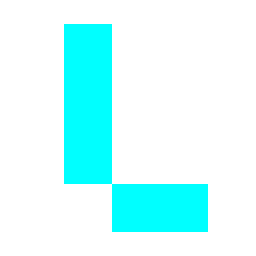

<p align="center">
  
</p>

---

# Lumini Programming Language


**Lumini** is an easy-to-learn, procedural, and minimalist programming language designed with a focus on **systems programming, safety, performance, and rapid development**.

The long-term goal of Lumini is to provide a unified programming environment that combines:

* Systems-level programming
* Game engine development
* Rapid application development
* Seamless C interoperability
* A unified toolchain and ecosystem
* Memory-safety features
* Robust language and compiler design
* Zero-cost high-level abstractions

Lumini is designed to keep the language simple while providing the low-level control expected from a systems programming language.

> **Note:** Lumini and its core toolchain are currently under active development. Language features, syntax, specifications, and tooling may change as the project evolves.

---

## Roadmap

The Lumini ecosystem is planned to include the following components:

* [ ] **Lumini VM (`lvm`)**
* [ ] **Lumini VM Bytecode Utility**
* [ ] **Lumini Language Specification**
* [ ] **Lumini Standard Library**
* [ ] **Lumini Compiler (`lc`)**
* [ ] **Lumini Shell (`lsh`)**

### Current Focus
1. **shared utilities**
   * [x] **ABI & ISA**
   * [x] **Wrappers**
   * [ ] **Memory Model**
   * [ ] **Syscall Interface**
   * [ ] **Other definitions & utilities**
   * [ ] **File Loader**

2. **lvm**:
   * [ ] **Instance**
   * [ ] **Runtime**
   * [ ] **CLI module**
   * [ ] **main entry**

The roadmap is subject to change as development progresses.

---

## Current Project Structure

```bash
├───image         # lumini graphics (icons, banners, etc.)
└───tools         # contains source code for all tools.
    ├───lvm       # lumini vm
    └───shared    # shared code between tools
```

> The exact architecture and component boundaries are still evolving.

---

## Development Status

Lumini is currently in **early development**.

The language, virtual machine, compiler, standard library, and tooling are being developed incrementally. APIs and language features should therefore be considered **unstable** until the corresponding specifications are finalized.

---

## Contact
For any suggestions, general questions, contact me using the following methods:

[](mailto:sayan.malik.102924@proton.me)
[](https://reddit.com/u/SayanMalik29)


## License

Lumini is licensed under the **Apache License, Version 2.0**.

You are free to use, modify, distribute, and use Lumini for personal or commercial purposes, subject to the terms and conditions of the license.

A copy of the license is available at:


[Apache License 2.0](https://www.apache.org/licenses/LICENSE-2.0)

---

Unless required by applicable law or agreed to in writing, 
software distributed under this license is provided **"AS IS"**, WITHOUT WARRANTIES OR CONDITIONS OF ANY KIND, either express or implied.
See the [Apache License 2.0](https://www.apache.org/licenses/LICENSE-2.0) for the specific language governing permissions and limitations.


---

<p align="center"> 
  Developed by: <a href="https://www.github.com/sayanm029">Sayan Malik</a>
</p>